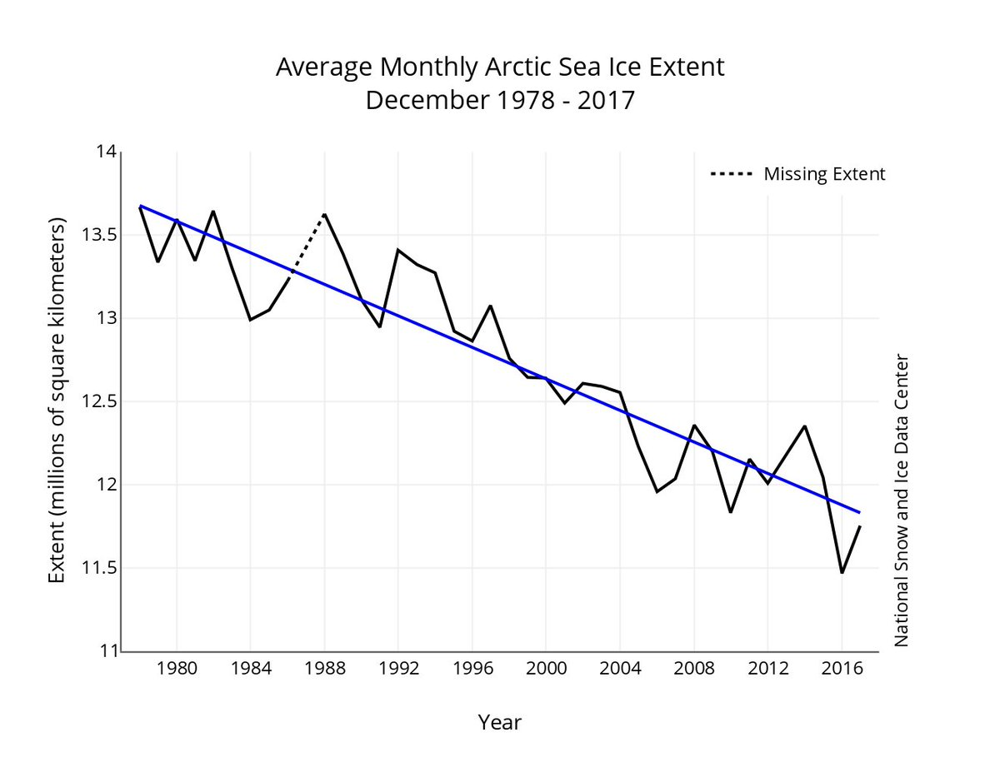
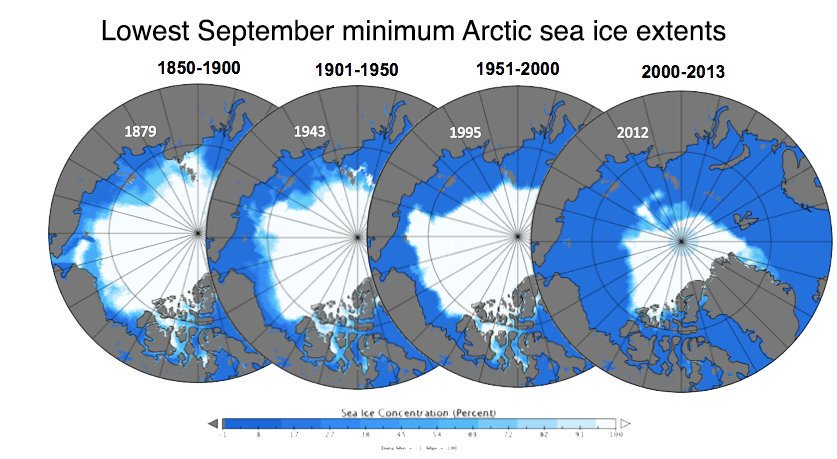

```{r setup, include=FALSE}
knitr::opts_chunk$set(echo = TRUE)
```

##### Incluir Im?gen


La extensi?n de hielo mensual de diciembre de 1979 a 2017 muestra una disminuci?n de 3.7 por ciento por d?cada. 




Estos mapas de concentraci?n de hielo marino comparan las m?nimas extensiones m?nimas de hielo marino ?rtico de septiembre para los per?odos especificados.

<https://twitter.com/estamundo/status/953666000876130304>.


## Chunck con c?digo de R


```{r millas,echo=TRUE}
library(ggplot2)
ggplot(data=mpg,aes(x=hwy,y=cty))+geom_point()+labs(x="Galones en carretera", y="Millas por gal?n ciudad", title="Gr?fico de dispersi?n: Rendimiento en millas")
```
```{r millas,fog.width=5,fig.height=5}```

##Incluir una tabla

``` {r,results="asis"}
library(xtable)
xtable(mpg[1:5,1:5])
```
